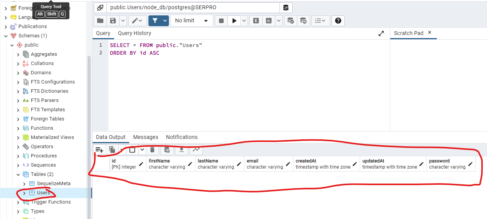
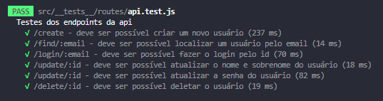

# User authentication

## Descrição

> API de operações básicas com usuários feita com Node.js e Express para simulação de operações de CRUD (Create, Read, Update e Delete). Projeto destinado a preparação da prova prática do concurso do SERPRO. Portanto, não colocar o código em produção.

## Requisitos para executar corretamente os testes

---

- Uma IDE, recomendo o [VS Code](https://code.visualstudio.com/);
- [Node JS](https://nodejs.org/en);
- [Git](https://git-scm.com/downloads);
- [Docker](https://www.docker.com/products/docker-desktop/).

## Tutorial para criar uma imagem do PostgreSQL no Docker com WSL (apenas Windows)

---

- [Configurando o WSL](https://learn.microsoft.com/en-us/windows/wsl/install);

- [Criando a imagem do PostgreSQL no Docker com WSL](https://towardsdatascience.com/local-development-set-up-of-postgresql-with-docker-c022632f13ea).

## Etapas antes de iniciar os testes

---

- Clone o repositório do GitHub ou use a opção de template para criar um repositório na sua conta do GitHub importando o projeto.

```shell

# Caso queira clonar diretamente o repositório
git clone "https://github.com/dev-ribeiro/user-authentication-template.git"

# Caso use a opção de use template faça o clone do repositório da sua própria conta
git clone "url do repositório da sua conta"

```

- Instale as dependências do projeto com o comando

```shell

npm install

```

- Configure as variáveis de ambiente, criando o arquivo .env na raiz do projeto. Aqui deve especificar todas as informações de acesso ao banco de dados PostgreSQL, previamente configurado e executando no docker, também se deve configurar o SECRET destinado a criptografia de senhas no projeto, pode ser qualquer string que desejar.

```shell

# PostgreSQL database
DB_HOST= # Exemplo: 127.0.0.1
DB_PORT= # Exemplo: 5432 (Porta padrão do Postgres)
DB_USER= # Por padrão, o usuário admin se chama postgres
DB_PASSWORD= # Sua senha
DB_DATABASE_NAME= # Nome do seu banco de dados

# Bcrypt
# Exemplo: SECRET = "ESTE_E_UM_SEGREDO_12"
SECRET=

```

- Execute as migrations, operação que cria as tabelas no banco de dados:

```shell

npm run migrate

```

OBS. Se tudo ocorrer corretamente será criada uma tabela no banco de dados Users. Você pode verificar os logs no seu terminal ou conferir no pgAdmin se a seguinte tabela foi criada:



Pronto, estas são todas as configurações necessárias para rodar o projeto. Agora implemente todas as funções pendentes e faça todos os testes passarem e também as interações com o frontend devem estar funcionais. Bom teste!

- Para testar a aplicação execute o comando:

```shell

npm run test

```

Quando concluir corretamente todas as implementações, deverá ser exibido o seguinte resultado:



## Especificação dos testes

---

### Endpoints da API

<br/>

#### 🔹 GET <span style="font-style: italic; font-size: 18px">/users/:email</span>

<div>

  <p style="text-indent: 16px">Esta rota deve retornar um usuário, caso exista, a partir do email passado como parâmetro da rota.</p>

  <p>
    Em caso de <span style="color: #00FF00">Sucesso</span>:
  </p>

  ```typescript
    // STATUS CODE = 200;

    // Deve retornar um usuário com a seguinte interface:
    interface User {
      firstName: string;
      lastName: string;
      email: string;
      password: string;
      createdAt: string;
      updatedAt: string;
    }
  ```

  <p>
    Em caso de <span style="color: #FF0000">Erro</span>:
  </p>

  ```typescript
    // STATUS CODE = 404;
  ```

</div>

---

#### 🔹 GET <span style="font-style: italic; font-size: 18px">/login/:email</span>

<div>

  <p style="text-indent: 16px">Esta rota possui um middleware que recebe o password, via header da requisição, e faz uma comparação do password criptografado com o password recebido, via função <span style="font-style: italic">comparePassword</span>. Este middleware deve atribuir a requisição o usuário encontrado se houver, ou lançar um erro.</p>

  <p>
    Em caso de <span style="color: #00FF00">Sucesso</span>:
  </p>

  ```typescript
    // STATUS CODE = 200;

    // Deve retornar um usuário com a seguinte interface:
    interface User {
      firstName: string;
      lastName: string;
      email: string;
      password: string;
      createdAt: string;
      updatedAt: string;
    }
  ```

  <p>
    Em caso de <span style="color: #FF0000">Erro</span>:
  </p>

  ```typescript
    // STATUS CODE = 400;
  ```

</div>

---

#### 🔹 POST <span style="font-style: italic; font-size: 18px">/users</span>

<div>

  <p style="text-indent: 16px">Esta recebe os parâmtros de cadastro (firstName, lastName, email, password) do usuário pelo body da requisição. Os campos id, createdAt e updatedAt, são criados e atualizados, no caso do updatedAt, pelo banco de dados.</p>

  <p>
    Em caso de <span style="color: #00FF00">Sucesso</span>:
  </p>

  ```typescript
    // STATUS CODE = 201;
  ```

  <p>
    Em caso de <span style="color: #FF0000">Erro</span>:
  </p>

  ```typescript
    // STATUS CODE = 400;
  ```

</div>

---

#### 🔹 PUT <span style="font-style: italic; font-size: 18px">/users/:id</span>

<div>

  <p style="text-indent: 16px">Esta rota pode receber os parâmetros de cadastro (firstName, lastName, e password) do usuário pelo body da requisição. Deve-se efetuar o tratamento de dados para update e verificar se há ou não atualização do password</p>

  <p>
    Em caso de <span style="color: #00FF00">Sucesso</span>:
  </p>

  ```typescript
    // STATUS CODE = 202;
  ```

  <p>
    Em caso de <span style="color: #FF0000">Erro</span>:
  </p>

  ```typescript
    // STATUS CODE = 400;
  ```

</div>

---

#### 🔹 DELETE <span style="font-style: italic; font-size: 18px">/users/:id</span>

<div>

  <p style="text-indent: 16px">Esta rota tem a função de apagar em definitivo um registro de usuário no banco de dados. Além disso, ela deve receber como parâmetro o id do usuário.</p>

  <p>
    Em caso de <span style="color: #00FF00">Sucesso</span>:
  </p>

  ```typescript
    // STATUS CODE = 202;
  ```

  <p>
    Em caso de <span style="color: #FF0000">Erro</span>:
  </p>

  ```typescript
    // STATUS CODE = 400;
  ```

</div>

---
